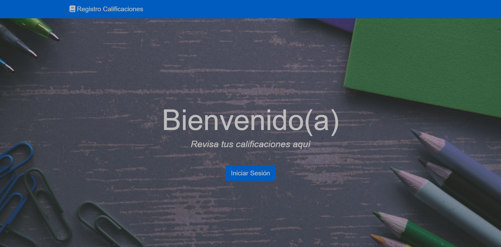
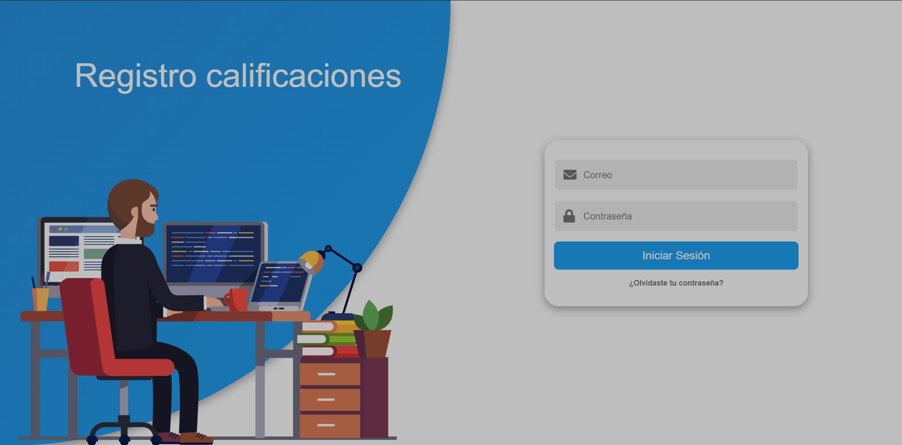

# Modulo de seguridad para el registro de calificaciones (Modulo_login)

Sistema desarrollado como proyecto para la clase de programación e implementación de sistemas

**Fue desarrollada con:**

-  NodeJs
-  Express
-  HandlebarsJs
-  JavaScript
-  JsonWebToken
-  MySQL

#### Instalación y configuración base del sistema

-  Clonar el repositorio con el siguiente comando:
   `git clone https://github.com/soymizra/RegistroDeCalificaciones.git`

-  Crear un archivo `.env` en la raíz del proyecto dentro de la carpeta RegistroDeCalificaciones. El contenido del archivo tendrán las variables para configurar la conexión a mysql. Ejemplo del archivo:
   ```
   MYSQL_HOST=localhost
   MYSQL_USER=root
   MYSQL_PASSWORD=""
   MYSQL_DATABASE=registro
   MYSQL_PORT=3306
   ```
-  Crear una rama diferente de `main`, con el nombre del modulo que se va a desarrollar, con el comando de ejemplo: `git checkout -b modulo_registro_calificaciones`

-  Posicionarse en la carpeta RegistroDeCalificaciones
   `cd RegistroDeCalificaciones/`

-  Instalar las dependencias del proyecto, con el comando: `npm install `

-  Ejecutar el proyecto con el comando: `npm run dev`

[Demo del modulo](http://app-aaf167a3-51b2-4191-b15d-b4bbf85e5262.cleverapps.io/)




